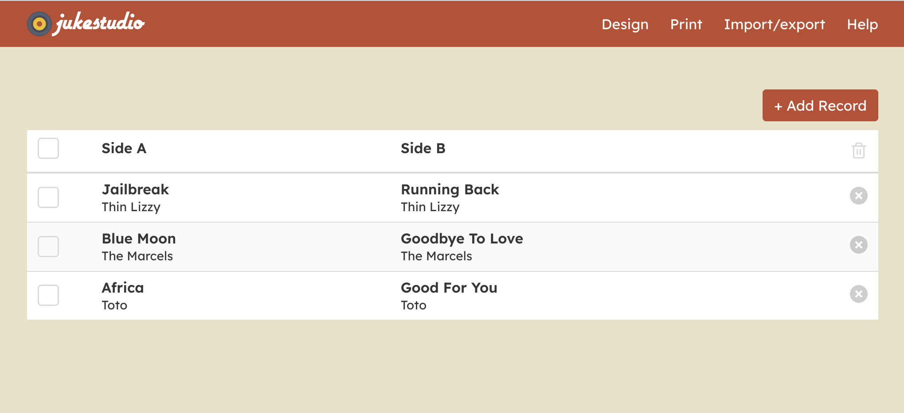
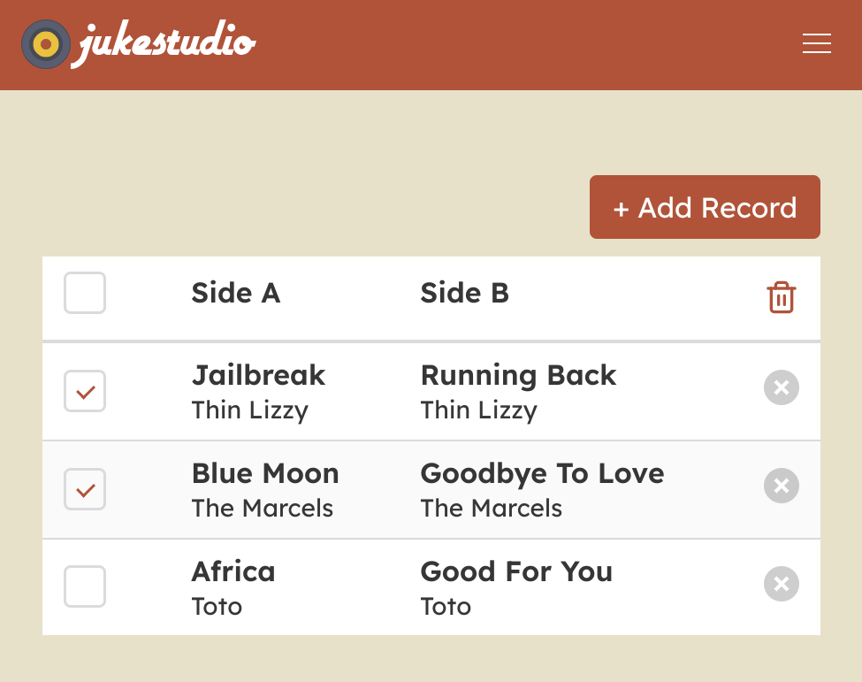
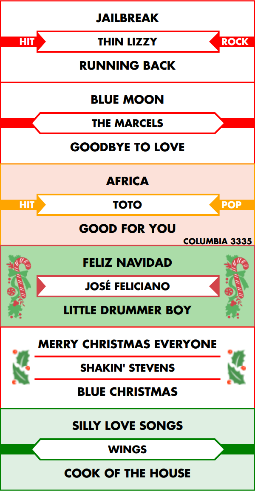

# juke.studio




JukeStudio is an online jukebox title strip creator that creates true-to-original title strips for 1950s and later jukeboxes.

This is the source repository, the application is available at https://juke.studio



## Development environment
```
git clone git@github.com:gilphilbert/jukestudio.git
cd jukestudio
npm i
npm run serve
```

### Building for production
```
npm run build
```